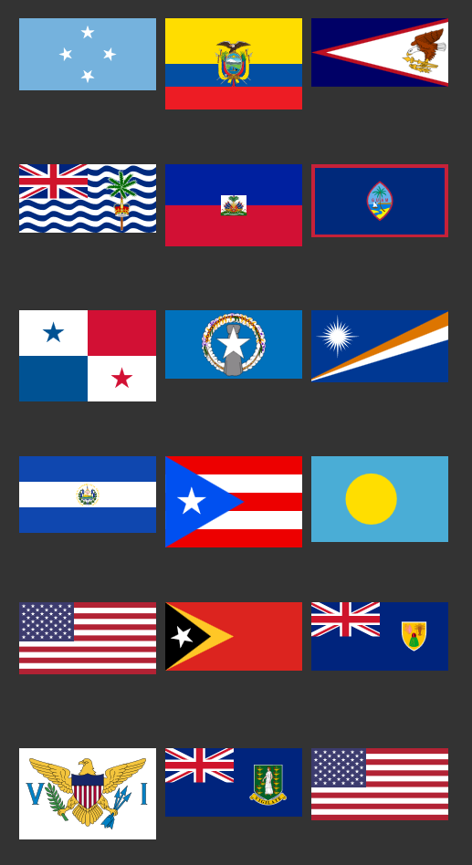
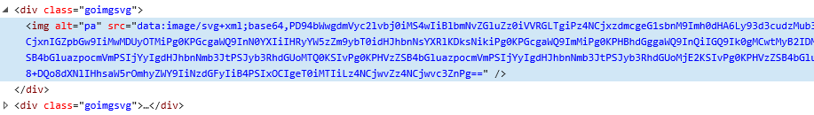

# goimgsvg

SVG as base64 inline images for use in Go-Lang templates

To be compatible with Microsoft Edge the SVG still have to be base64 encoded as currently only Chrome supports pure SVG as inline image.

<https://css-tricks.com/probably-dont-base64-svg/>

<https://css-tricks.com/lodge/svg/09-svg-data-uris/>

Example:

// Create instance - better call only once because of the performance bottleneck  
svg := goimgsvg.NewGoImgSVG()

// Print an svg based on svg filename in the folder ./assets/goimgsvg/svg/  
flag := svg.GetSVGByFilename("eur")

// Print all .tld-svg related supplied currency tru translation in the folder ./assets/goimgsvg/tld_cur.tsv  
flag := svg.GetSVGByCurrency("eur")

